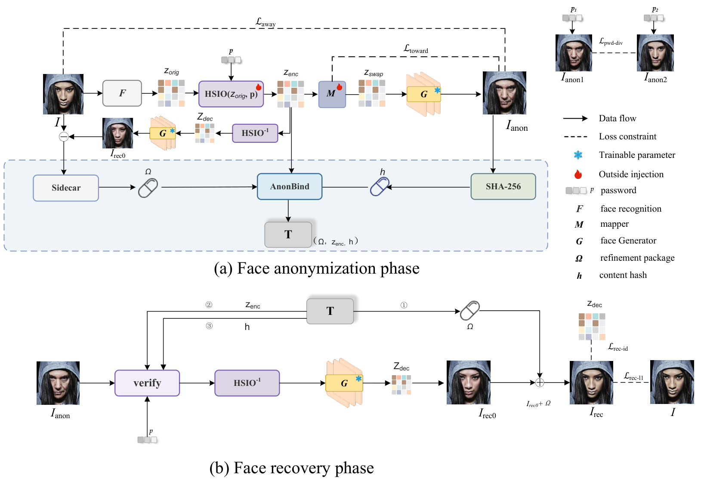
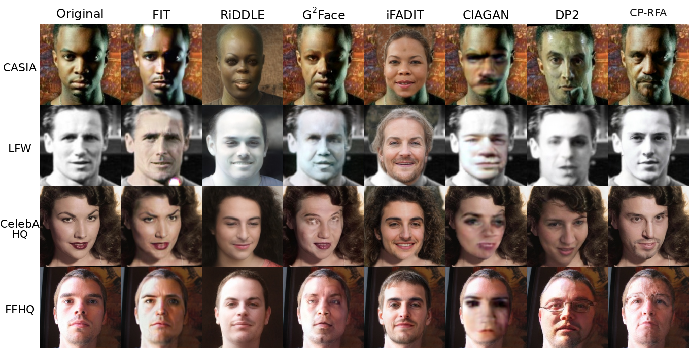

# CP-RFA

**Official PyTorch implementation** of

> **CP-RFA: Chaos-driven Password-controlled Reversible Face Anonymization**<br>
> Chen Yang, Rong Chen, Shuyuan Lin, Gencheng Wang, Zhangyang Cong<br>
> Xizang Minzu University, Jinan University<br>
> [*Journal of Information Security and Applications*](https://www.sciencedirect.com/journal/journal-of-information-security-and-applications) (under review)

This repository is the official code of **CP-RFA**. The GitHub repository is named [`CP-RFA`](https://github.com/qingfengwanyang/CP-RFA) (the URL used in the paper).

## News

- **2026.09** Code, mapper checkpoint, and demo released.

## Abstract

With the widespread use of social media, protecting facial privacy has become increasingly important. Reversible face anonymization hides identity in released faces while still allowing authorized identity restoration. Existing methods still suffer from residual identity cues, weakly bound recovery credentials (e.g. cross-image token replay), and a trade-off between anonymity and reconstruction.

We propose **CP-RFA**. A password-derived Logistic keystream drives a hypersphere signed-permutation identity operator (**HSIO**) on unit ArcFace features and encrypts the **AnonBind** recovery token. HSIO shuffles and flips feature signs while keeping the unit norm, and a password-conditioned mapper enlarges appearance diversity. AnonBind binds each token to the anonymized image via SHA-256. A compact Sidecar residual in the token refines authorized recovery.

On LFW, authorized recovery identity similarity is **0.958** and PSNR reaches **37.75 dB**, with a recovery token of about **19.8 KB** per image.

## Framework

<p align="center">
  
</p>
<p align="center"><em>Fig. 1. CP-RFA pipeline. (a) Anonymization with HSIO, mapper and AnonBind. (b) Authorized recovery.</em></p>

## Qualitative results

<p align="center">
  
</p>
<p align="center"><em>Fig. 2. Anonymized faces and authorized recoveries on public datasets (from the paper).</em></p>

## Installation

Python 3.8+ is required. A GPU is recommended. **InsightFace must be ≥ 0.7.3** (0.2.x is not compatible).

```bash
git clone https://github.com/qingfengwanyang/CP-RFA.git
cd CP-RFA
pip install -r requirements.txt
```

Optional conda environment:

```bash
conda create -n cprfa python=3.8 -y
conda activate cprfa
pip install -r requirements.txt
```

## Pretrained models

| File | Source | Notes |
|------|--------|--------|
| `checkpoints/mapper_best.pth.tar` | **included** | Trained mapper + frozen HSIO seed projection |
| `checkpoints/hyperswap/hyperswap_1a_256.onnx` | [download](https://huggingface.co/facefusion/models-3.3.0/resolve/main/hyperswap_1a_256.onnx) | Third-party HyperSwap generator (not redistributed) |
| `checkpoints/insightface/models/buffalo_l/` | auto-download on first run | InsightFace detection + ArcFace |

```bash
mkdir -p checkpoints/hyperswap
wget -O checkpoints/hyperswap/hyperswap_1a_256.onnx \
  https://huggingface.co/facefusion/models-3.3.0/resolve/main/hyperswap_1a_256.onnx
```

See `checkpoints/README.md` for paths and licenses.

## Inference

```bash
python demo.py --image /path/to/your_face.jpg --out runs/demo
```

Outputs in `runs/demo/`:

| File | Description |
|------|-------------|
| `anon.png` | Public anonymized crop (PNG; JPEG would break AnonBind) |
| `rec0.png` | Initial recovery (mapper bypassed, HSIO inverted) |
| `rec.png` | Sidecar-refined authorized recovery |
| `recovery.token` | AnonBind token (`CPRFA-1\|...`, ~20 KB) |

A typical frontal face should be near the paper operating point: **ID<sub>anon</sub> ≈ 0.02–0.08**, **ID<sub>rec</sub> ≈ 0.95+** (LFW in the paper: 0.047 / 0.958). Full table numbers need the evaluation sets, which are not redistributed.

Python API:

```python
from models.chaos_simswap_pipeline import CPRFAConfig, CPRFAPipeline
from utils.password import generate_code

cfg = CPRFAConfig(
    mapper_ckpt='checkpoints/mapper_best.pth.tar',
    swap_backend='hyperswap',
    hyperswap_model='checkpoints/hyperswap/hyperswap_1a_256.onnx',
    insightface_root='checkpoints/insightface',
    crop_size=256,
)
pipe = CPRFAPipeline(cfg)

password, *_ = generate_code(16, 1, pipe.device, False, True, False)
reg = pipe.register_from_path('face.jpg', password, slug='user001')
rec = pipe.recover_from_token(
    reg.anon_crop_bgr, reg.token, password, z_orig_ref=reg.z_orig)
print(reg.id_anon, rec.id_rec)
```

Recovery needs the anonymized **PNG**, the token and the password. HSIO and AnonBind share the same Logistic keystream, so a later Python process can decrypt the same token.

## Training

HSIO is parameter-frozen. Sidecar is packed at registration time, not learned. Only the mapper is trained.

Prepare CASIA-WebFace with `casia_landmark.txt` and set:

```bash
export CHAOS_DATA_ROOT=/path/to/data_root
export HYPERSWAP_MODEL=checkpoints/hyperswap/hyperswap_1a_256.onnx
python train_hyperswap_mapper.py
```

## Results (from the paper)

Reported on LFW for CP-RFA:

| ID<sub>anon</sub> ↓ | ID<sub>rec</sub> ↑ | PSNR ↑ | Token |
|---------------------|--------------------|--------|--------|
| 0.047 | 0.958 | 37.75 dB | ~19.8 KB |

Comparisons on CASIA-WebFace, LFW, CelebA-HQ and FFHQ are in the paper.

## Citation

If you use this code, please cite:

```bibtex
@article{yang2026cprfa,
  title     = {{CP-RFA}: Chaos-driven Password-controlled Reversible Face Anonymization},
  author    = {Yang, Chen and Chen, Rong and Lin, Shuyuan and Wang, Gencheng and Cong, Zhangyang},
  journal   = {Journal of Information Security and Applications},
  year      = {2026},
  note      = {under review}
}
```

## Acknowledgements

HyperSwap ONNX and InsightFace `buffalo_l` are provided by their respective authors. This repository ships CP-RFA code and the trained mapper only. Use public or licensed face images; do not upload private biometric data to GitHub.

## License

This project is released under the [MIT License](LICENSE).
